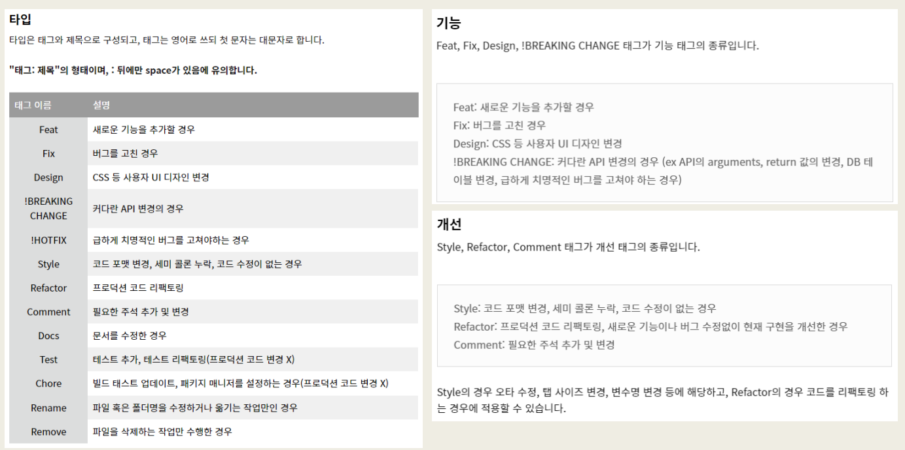
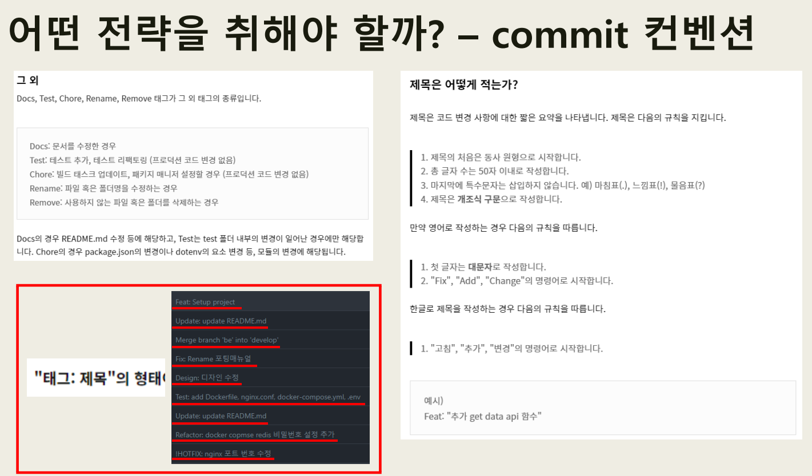

B205 자율프로젝트

### Branch

| GIT FLOW를 참조하여 개발할 것.

### GIT Convention

---
# 🌊  OpenAPI  

---
### 0️⃣ TIL
---
### ❗️ 목적
- #### 
---
### 📚 2023.10.18
#### 오늘 한 일
요구사항 명세서 작성, 기능 명세서 작성, 프로젝트 주제 설정 및 구체화

#### 배운점
키워드 추출 알고리즘과 단어 유사도 알고리즘을 찾아 보았다. 
여러 가지 종류가 있고 각각 장단점을 아직 알아보지 않았다.
특징을 찾아본 후 최적의 알고리즘을 찾아볼 예정이다. 
---

