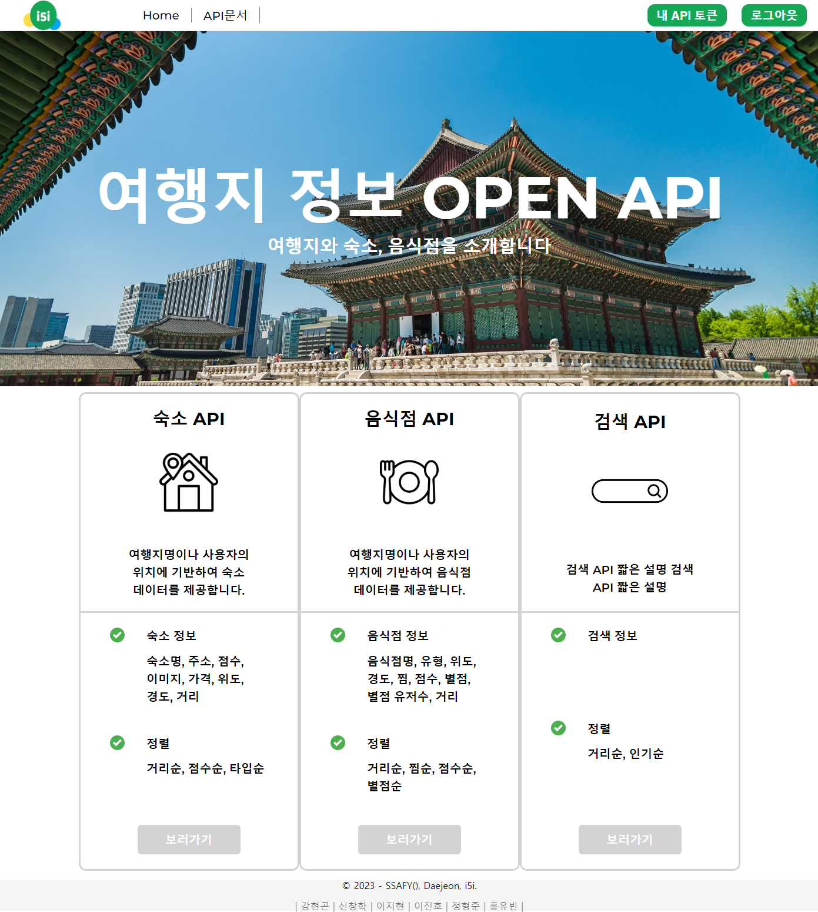
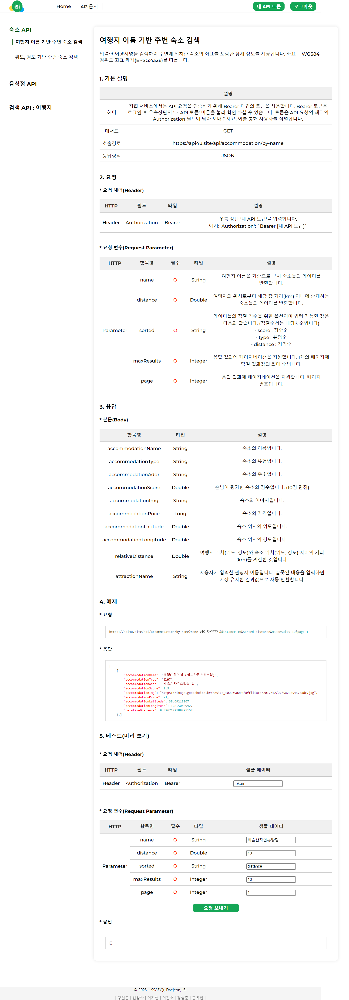
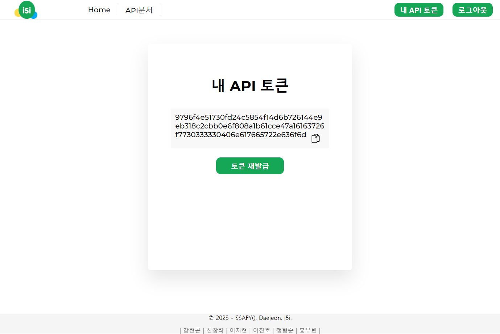
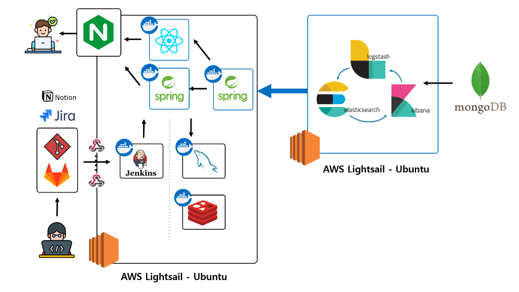
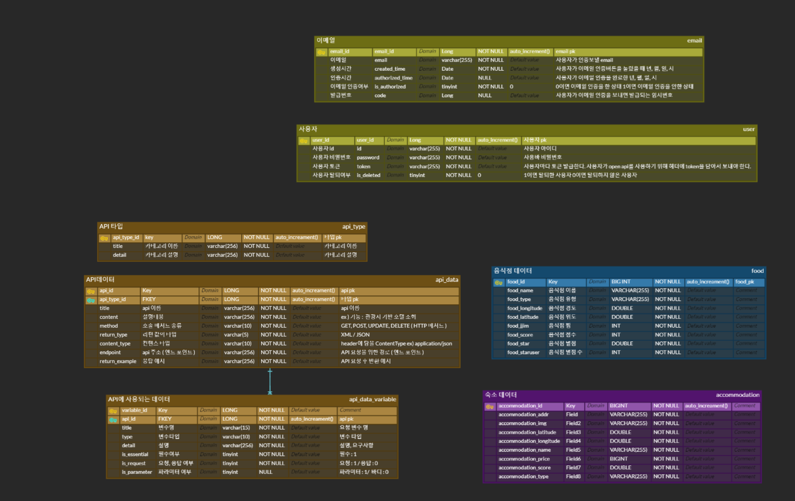

# 👨‍💻 SSAFY TRIP OPEN API
**여행 서비스를 위한 OPEN API**  
**바로가기 : https://k9b205.p.ssafy.io**
 

## ⬇️⬇️프로젝트 소개 (youtube로 보러가기)⬇️⬇️
[동영상 링크](https://www.youtube.com/watch?v=DyyWZVai3vw)
  
싸피 1학기 개발자들이 진행하는 여행 웹 서비스 개발을 좀 더 풍성하게 해주기위한 여행관련 openAPI
- 기존 싸피 1학기 개발자들이 제공받는 여행지 데이터베이스를 이용, 그와 관련한 숙소, 음식점, 위키 데이터를 추가적으로 수집하여다양한 openAPI를 만들어 제공한다.  

1. 여행지 관련 숙소 API
 - 여행지 이름 기준으로 주변 숙소 정보를 얻는다
 - 위경도 기준으로 주변 숙소 정보를 얻는다

2. 여행지 관련 음식점 API
 - 여행지 이름 기준으로 주변 음식점 정보를 얻는다 
 - 위경도 기준으로 주변 숙소 정보를 얻는다

3. 검색 보정 API
 - [제목 검색] 제목의 오탈자를 보정하여 유사한 보정 결과를 반환한다.
 - [전문 검색] 입력 문장을 기준으로 데이터의 모든 필드를 환산하여 가장 유사한 내용을 가진 결과값을 반환한다.
 - 입력 문장과 거리, 점수, 입력 파라미터의 조건을 기준으로 가장 높은 검색 결과를 반환한다.

4. 데이터 신뢰성 측정 및 데이터시각화
 - 수집하여 저장된 데이터의 내용 유사도를 판단하여 신뢰성 있는 결과를 제공한다.
 - 수집된 인덱스의 도큐먼트 중, 가장 많은 검색 결과를 Kibana를 활용하여 차트의 형태로 제공한다.
 - logstash를 사용하여 API 요청 회수와 종류를 데이터로 수집하고, 차트의 형태로 제공한다.

5. 스크래핑
 - python으로 스크래핑 코드 작성
 - robots.txt 확인
 - '여기어때', '다이닝코드' 사이트에서 숙소정보와 음식점정보 
 
  

## 📅프로젝트 기간

**23.10.10 ~ 23.11.16 (6주간)**    

## 🛠️ 서비스 화면 

홈 페이지 

Home

 

API 사용을 위한 Docs 페이지 

Docs

 

API 사용을 위한 Token 발급 페이지 

TokenPage

 

## 🧝‍♂️팀원 및 역할  

| **팀장** | 신창학 (BE: Elastic search API, Sub server Infra, Kibana 데이터시각화, Logstash 데이터 수집 및 데이터 신뢰성 처리)   |
|----------|---------------------|
| **팀원** | 강현곤 (BE: 숙소 데이터 크롤링, 숙소 데이터 API)             |
| **팀원** | 이지현 (BE: 음식점 데이터 크롤링, 음식점 데이터 API )  |
| **팀원** | 이진호 (Infra : EC2, nginx, docker, jenkins 세팅)     |
| **팀원** | 정형준 (BE: 데이터 크롤링 보조, 숙소 데이터 API, Java Global 객체, 처리율 제한, 부하테스트) |
| **팀원** | 홍유빈 (BE: Docs API, 전자사전 전처리, 처리율 제한, 부하테스트 )  |

## 👨‍👩‍👧협업 툴  

- GitLab
- Jira
- Notion
- Mattermost

## 🖥️ 개발 환경  

🖱**Backend**

- IntelliJ
- spring boot 2.7.17
- spring-boot-jpa
- Spring Security
- Java 11

🖱**DB**

- mysql 8.0.23
- Redis 7.2.1
- MongoDB Cloud

🖱**Frontend**

- Visual Studio Code
- React.js 18.2.0
- node.js 18.16.1
- axios 1.4.0
- styled-components 6.0.4

🖱**Infra**

- AWS EC2
- docker
- nginx
- jenkins

## 🔧 서비스 아키텍쳐  

## 📑 API 명세서  

## ✨ERD  

## 📚 커밋 컨벤션 규칙

| Type 키워드 | 사용 시점 |
| --- | --- |
| 첫 커밋 | CREATE: start project |
| Add | 새로운 파일 추가 |
| Delete | 파일 삭제 |
| Feat | 새로운 기능 추가, 기존의 기능을 요구 사항에 맞추어 수정 |
| Fix | 기능에 대한 버그 수정 |
| Build | 빌드 관련 수정 |
| Chore | 패키지 매니저 수정, 그 외 기타 수정 ex) .gitignore |
| Ci | CI 관련 설정 수정 |
| Docs | 문서(주석) 수정 |
| Style | 코드 스타일, 포맷팅에 대한 수정 |
| Refactor | 기능의 변화가 아닌 코드 리팩터링 ex) 변수 이름 변경 |
| Test | 테스트 코드 추가/수정 |
| Release | 버전 릴리즈 |
| Rename | 파일 혹은 폴더명을 수정만 한 경우 |
| Readme | README |
| Comment | 주석관련 |

 ***commit message***
  - commit은 최대한 자세히

`키워드(대문자) :  (영어로 위치/함수/기능) + 설명`

## 🌐EC2 PORT

| 서비스                 | 포트  |
|-----------------------|-------|
| Spring Boot | 8080  |
| Spring Boot: Elastic search | 8081  |
| React                 | 3000  |
| MySQL                 | 4000  |
| Jenkins               | 9090  |

## 처리율 제한 동기화 문제 해결
###### - 문제 정의 : 사용자 별 하루 당 10만회의 API 사용을 제한하기 위한 인터셉터 Count 함수에서 동기화 문제 발생
###### -  문제 설명 : 레디스의 {토큰 : cnt} 데이터를 여러 스레드에서 수정하는 과정에서 레이스컨디션 문제 발생
###### -  문제 해결 : Java의 Synchronized ( Monitor ) / MySQL Lock / Redis Redisson ( distributed lock )의 성능 측정 후 가장 성능이 좋았던 Synchronized 활용
###### -  성능 측정 : Ngrinder를 통해 각각의 동기화에 대한 초당 처리율 (TPS) 측정 결과 Synchronized : 302 / MySQL : 167 / Redisson : 217
###### -  확장에 대한 고려 : 단일 프로세스 환경에서는 Synchronized로 충분했으나, 로드밸런싱을 고려할 경우 DB를 사용하여 Redisson으로의 전환을 고려

## 부하테스트 이슈 발생
###### -  문제 정의 : Ngrinder로 최악의 상황을 가정하여 100명의 유저가 끊임없이 request를 보내는 환경에서 error의 비율과 response 속도 측정
###### -  문제 설명 : ThreadPool을 default로 설정했을 경우 평균 응답시간 2.5초 / error 비율 26.9% 를 확인
###### -  문제 해결 : ThreadPool의 최대 Thread, 최소 동작 Tread, WaitQueue 사이즈를 조절하여 평균 응답시간 2.7초 / error 비율 0%로 개선
###### -  연구 결과 : Synchronized에 의해 대기하고있는 스레드가 많아 최대 Thread수를 조절하여 error를 줄이는 것에 성공

